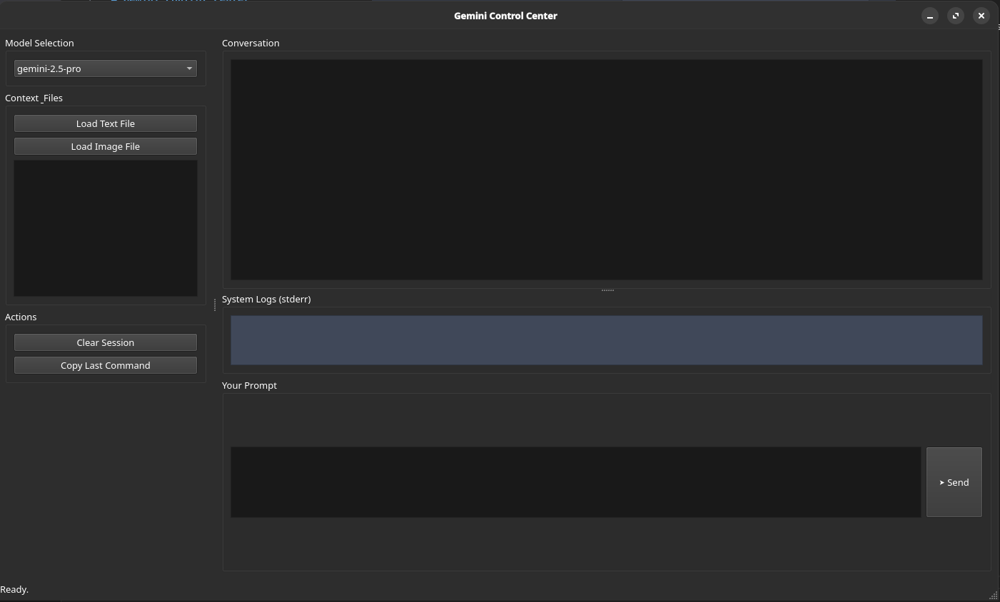

# Gemini Control Center

A graphical user interface (GUI) for interacting with a `gemini` command-line tool. This application provides a user-friendly way to construct and send prompts, manage conversation history, and include context from local files, all without needing to type complex commands in the terminal.


*(Note: You will need to create this screenshot and place it in a `docs` folder)*

---

## Features

-   **Interactive Conversation View**: See the history of your conversation with Gemini, with user prompts and AI responses clearly distinguished.
-   **Model Selection**: Easily switch between compatible Gemini models (e.g., `gemini-2.5-pro`, `gemini-2.5-flash`).
-   **File Context**: Load local text (`.txt`) and image (`.png`, `.jpg`, `.jpeg`) files to provide context for your prompts.
-   **System Log Viewer**: A dedicated panel shows `stderr` output for easy debugging of the underlying `gemini` command.
-   **Session Management**: Clear the current session to start a new conversation.
-   **Command Inspector**: Copy the exact `gemini` command that was executed for your last prompt.
-   **Responsive UI**: Asynchronous command execution prevents the UI from freezing while waiting for a response.
-   **Modern Dark Theme**: A clean, dark interface for comfortable use.

## Prerequisites

Before you begin, ensure you have the following installed and configured:

1.  **Python 3.x**
2.  **PyQt6**: The GUI is built using this library.
3.  **Gemini CLI**: The core `gemini` command-line tool must be installed and accessible in your system's `PATH`.
4.  **API Key**: You must have a `GEMINI_API_KEY` environment variable set with your valid API key.

## Installation & Setup

1.  **Clone the repository:**
    ```bash
    git clone https://github.com/MirkoCuccurullo/gemini-cli-ui.git
    cd gemini-cli-ui
    ```

2.  **Install dependencies:**
    This project requires `PyQt6`. You can install it using pip:
    ```bash
    pip install PyQt6
    ```
    *(It's recommended to do this in a virtual environment.)*

3.  **Set your API Key:**
    Make sure your `GEMINI_API_KEY` is set as an environment variable.

    -   On **Linux/macOS**:
        ```bash
        export GEMINI_API_KEY="YOUR_API_KEY_HERE"
        ```
    -   On **Windows**, you can set it in your system's environment variable settings.

## Usage

To run the application, execute the Python script from the project's root directory:

```bash
python gemini_gui.py
```

-   Type your prompt in the input box at the bottom and press **Enter** (or **Shift+Enter** for a new line) or click the **"➤ Send"** button.
-   Use the buttons on the left pane to load files or manage the session.

---
